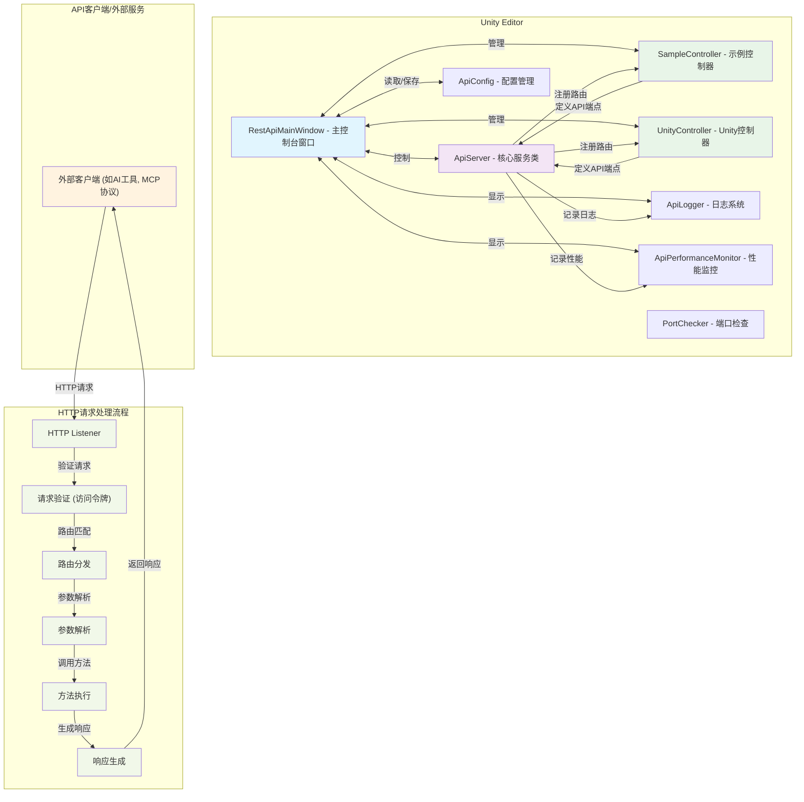

# Local REST API 架构图

## 系统架构概览

## 组件职责说明

### 1. RestApiMainWindow (主控制台窗口)
- **职责**: 提供图形用户界面，控制API服务的启停，显示性能监控和日志信息
- **功能**:
  - 服务状态控制
  - 访问令牌管理
  - 性能指标显示
  - API路由列表展示
  - 服务日志查看

### 2. ApiServer (核心服务类)
- **职责**: 实现HTTP服务器功能，处理所有API请求
- **功能**:
  - HTTP请求监听
  - 身份验证（访问令牌）
  - 路由分发
  - 参数解析和绑定
  - 响应生成

### 3. 控制器类 (SampleController, UnityController)
- **职责**: 定义具体的API端点和业务逻辑
- **功能**:
  - 使用`[GetRoute]`和`[PostRoute]`属性标记API端点
  - 实现具体的API业务逻辑
  - 返回JSON格式的响应

### 4. 配置和辅助类
- **ApiConfig**: 管理服务地址和访问令牌的持久化存储
- **ApiLogger**: 记录API请求和错误日志
- **ApiPerformanceMonitor**: 监控API性能指标
- **PortChecker**: 检查端口可用性

## 数据流

1. **外部客户端**发送HTTP请求到API服务器
2. **HTTP Listener**接收请求并传递给**请求验证**模块
3. **请求验证**检查访问令牌的有效性
4. **路由分发**根据URL和HTTP方法匹配对应的控制器方法
5. **参数解析**从请求中提取参数并转换为方法参数
6. **方法执行**调用对应的控制器方法
7. **响应生成**将方法返回值序列化为JSON并返回给客户端

## 扩展机制

- 通过创建新的控制器类并使用`[GetRoute]`或`[PostRoute]`属性标记方法来扩展API功能
- 系统自动扫描并注册所有标记的API端点
- 支持在主控制台中直接跳转到API端点的代码实现